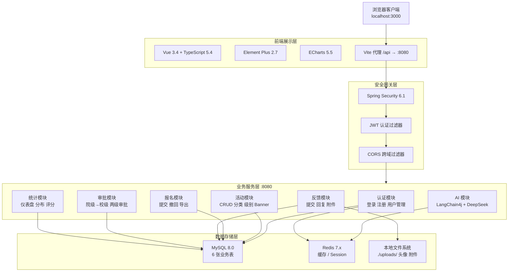
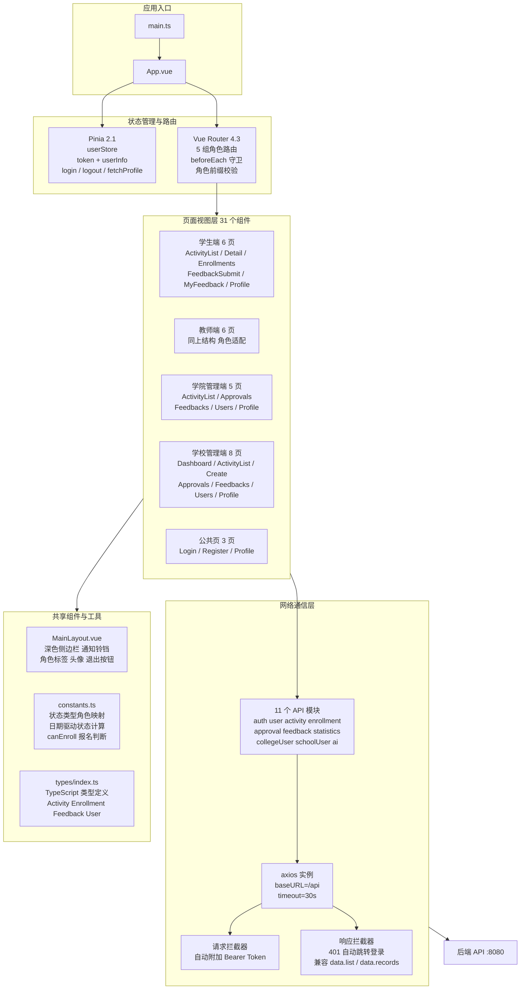
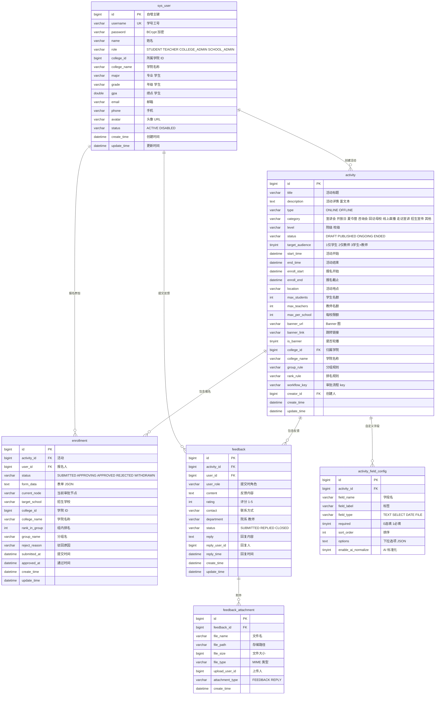
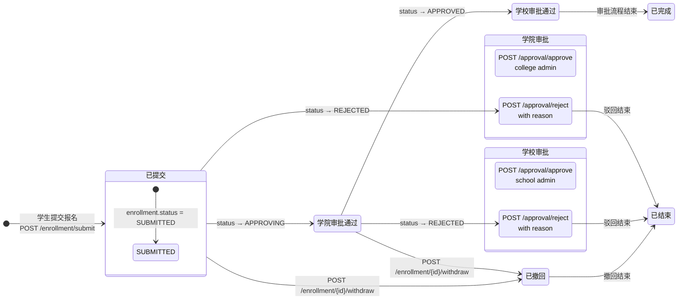
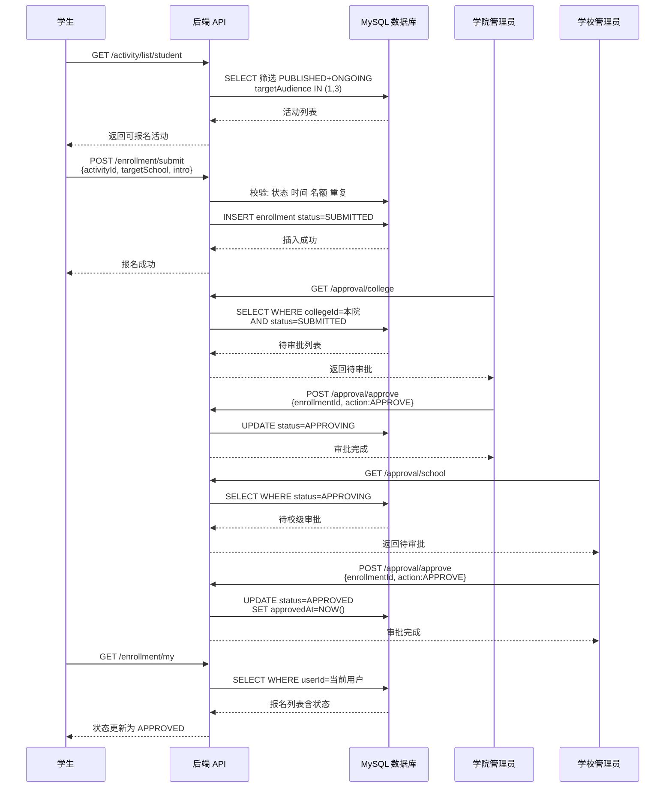

# 新疆大学招生宣传报名平台 架构设计文档

> 2026-07-13 | [github.com/spider-freedom/enrollment-platform](https://github.com/spider-freedom/enrollment-platform)

---

## 一、系统架构总览

---

## 二、前端技术架构

---

## 三、后端模块详解

```mermaid
graph TB
    subgraph SecurityLayer["安全模块"]
        JwtUtils["JwtUtils<br/>HS256 签名<br/>生成 验证 解析 Token<br/>载荷: userId role sub exp"]
        JwtFilter["JwtAuthFilter<br/>提取 Authorization Header<br/>跳过 /auth 和 /doc.html<br/>设置 SecurityContext"]
        SecConfig["SecurityConfig<br/>无状态会话<br/>CSRF 禁用<br/>URL 角色授权<br/>college→COLLEGE_ADMIN<br/>school→SCHOOL_ADMIN<br/>其余→authenticated"]
    end

    subgraph ControllerLayer["控制器层 11 个"]
        AuthCtrl["AuthController<br/>POST /auth/login<br/>POST /auth/register"]
        UserCtrl["UserController<br/>GET/PUT /user/profile<br/>PUT /user/password<br/>POST /user/avatar 上传"]
        CollegeUserCtrl["CollegeUserController<br/>GET /college/users/list<br/>POST promote demote<br/>POST import CSV<br/>DELETE resetPassword"]
        SchoolUserCtrl["SchoolUserController<br/>GET /school/users/list<br/>POST promoteCollege<br/>POST promoteSchool<br/>POST demoteToTeacher"]
        ActivityCtrl["ActivityController<br/>POST create / PUT update<br/>DELETE delete / POST banner<br/>GET list student teacher<br/>GET list college school<br/>GET banners export"]
        EnrollmentCtrl["EnrollmentController<br/>POST submit<br/>GET my college school<br/>POST withdraw<br/>GET export"]
        FeedbackCtrl["FeedbackController<br/>POST student teacher<br/>GET college school my<br/>POST reply / GET export"]
        ApprovalCtrl["ApprovalController<br/>GET college school<br/>POST approve reject<br/>POST batch"]
        StatsCtrl["StatisticsController<br/>GET dashboard trend<br/>GET college rating"]
        AttachCtrl["AttachmentController<br/>POST upload<br/>GET download"]
        AICtrl["AiController<br/>GET school/suggest<br/>POST school/normalize<br/>POST feedback/analyze<br/>POST approval/suggest"]
    end

    subgraph ServiceLayer["服务层 7 个"]
        UserSvc["UserService<br/>@Transactional 类级<br/>login register profile<br/>promote demote import<br/>resetPassword toggleStatus"]
        ActivitySvc["ActivityService<br/>@Transactional 类级<br/>create update delete<br/>listFor 4 种角色<br/>toggleBanner getBanners"]
        EnrollmentSvc["EnrollmentService<br/>@Transactional 提交 撤回<br/>listMy listForCollege<br/>listForSchool 导出"]
        FeedbackSvc["FeedbackService<br/>@Transactional 提交 回复<br/>listMy listForCollege<br/>listForSchool 附件关联"]
        ApprovalSvc["ApprovalService<br/>@Transactional 审批 驳回<br/>getPendingForCollege<br/>getPendingForSchool<br/>batchApprove 批量"]
        StatsSvc["StatisticsService<br/>dashboard 仪表盘<br/>monthlyTrend 月度趋势<br/>collegeDist 学院分布<br/>ratingDist 评分分布"]
        AISvc["LangChain4j 集成<br/>SchoolNameNormalizer<br/>FeedbackAnalyzer<br/>DeepSeek API 调用"]
    end

    subgraph DataLayer["数据访问层"]
        MyBatisConfig["MyBatis-Plus 3.5.7<br/>BaseMapper 通用 CRUD<br/>分页插件 MySQL 方言<br/>map-underscore-to-camel-case"]
        MetaHandler["MetaObjectHandler<br/>createTime 自动填充<br/>updateTime 自动填充"]
        EntityList["6 个实体类<br/>User Activity Enrollment<br/>Feedback FeedbackAttachment<br/>ActivityFieldConfig"]
        MapperList["6 个 Mapper 接口<br/>继承 BaseMapper<br/>自定义 LambdaWrapper"]
    end

    JwtFilter --> JwtUtils
    JwtFilter --> SecConfig
    ControllerLayer --> ServiceLayer
    ServiceLayer --> DataLayer
    DataLayer --> MySQL[("MySQL 8.0")]
```

---

## 四、数据库 ER 图

---

## 五、审批流程状态机

---

## 六、数据流 报名全链路

---

## 七、技术栈明细

### 后端技术栈

| 类别 | 技术 | 版本 | 用途 | 应用模块 |
|------|------|------|------|----------|
| 语言 | Java | 17 LTS | 主编程语言 | 全部 |
| 框架 | Spring Boot | 3.2.5 | IoC DI MVC 自动配置 | 全部 |
| 安全 | Spring Security | 6.1 | 认证授权框架 | security/ |
| 令牌 | JJWT | 0.12.5 | JWT 生成 验证 解析 | security/JwtUtils |
| ORM | MyBatis-Plus | 3.5.7 | 数据库映射 分页 CRUD | mapper/ entity/ |
| 连接池 | HikariCP | Spring Boot 内置 | 数据库连接池 | 自动配置 |
| 校验 | Jakarta Validation | 3.0 | DTO 参数校验 @Valid | 全部 Controller |
| AI | LangChain4j | 0.35.0 | LLM 集成框架 | ai/ |
| AI | DeepSeek API | deepseek-chat | 大语言模型 | ai/AiConfig |
| 文档 | Knife4j | 4.5.0 | Swagger UI 接口文档 | 自动扫描 |
| Excel | Apache POI | 5.2.5 | Excel 导入导出 | common/ExcelExportUtil |
| 工具 | Hutool | 5.8.28 | 通用工具类 | 全局 |
| JSON | Jackson | Spring Boot 内置 | JSON 序列化 | 自动配置 |
| 日志 | SLF4J Logback | Spring Boot 内置 | 日志输出 | 自动配置 |
| 测试 | JUnit 5 | Spring Boot 内置 | 单元测试 | test/ |

### 前端技术栈

| 类别 | 技术 | 版本 | 用途 | 应用模块 |
|------|------|------|------|----------|
| 框架 | Vue 3 | 3.4 | 响应式 UI 框架 Composition API | 全部 .vue |
| 语言 | TypeScript | 5.4 | 类型安全 | 全部 .ts |
| UI 库 | Element Plus | 2.7 | 组件库 表格 表单 弹窗 | 全部视图 |
| 图标 | Element Plus Icons | 2.3 | SVG 图标集 | 全部视图 |
| 路由 | Vue Router | 4.3 | SPA 路由 导航守卫 | router/ |
| 状态 | Pinia | 2.1 | 全局状态管理 userStore | stores/ |
| HTTP | Axios | 1.7 | HTTP 客户端 拦截器 | api/ |
| 图表 | ECharts | 5.5 | 数据大屏 统计图表 | SchoolDashboard |
| CSS | Sass | 1.77 | CSS 预处理 | 全部 .vue |
| 构建 | Vite | 5.3 | 开发服务器 HMR 打包 | vite.config.ts |
| 类型 | Vue TSC | 2.0 | TypeScript 类型检查 | 构建时 |
| 工具 | unplugin-auto-import | 0.17 | 自动导入 Vue API | 自动配置 |
| 工具 | unplugin-vue-components | 0.27 | 自动导入 Element Plus | 自动配置 |

### 基础设施

| 类别 | 技术 | 版本 | 用途 |
|------|------|------|------|
| 数据库 | MySQL | 8.0 | 主数据存储 6 张表 |
| 缓存 | Redis | 7.x | 缓存 Session 共享 |
| 构建 | Maven | 3.8+ | 后端依赖管理 构建 |
| 运行时 | JDK | 17 | Java 运行环境 |
| 运行时 | Node.js | 18+ | 前端开发运行环境 |
| 容器 | Docker Compose | 3.8 | 可选 容器化部署 MySQL Redis |