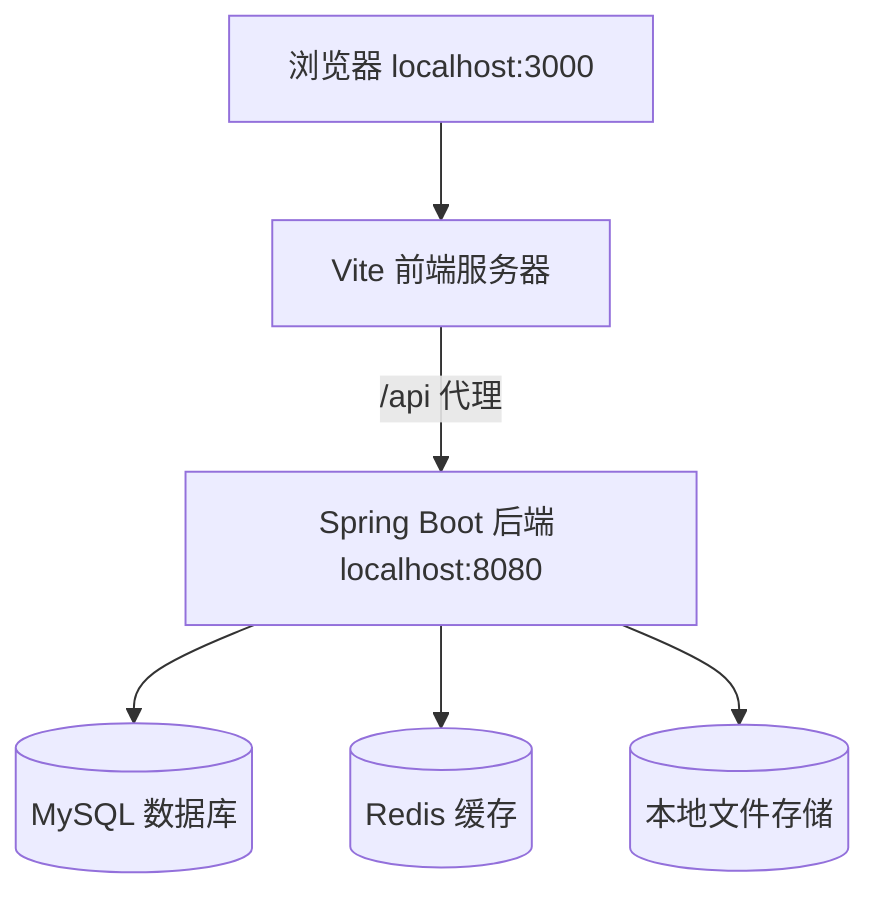
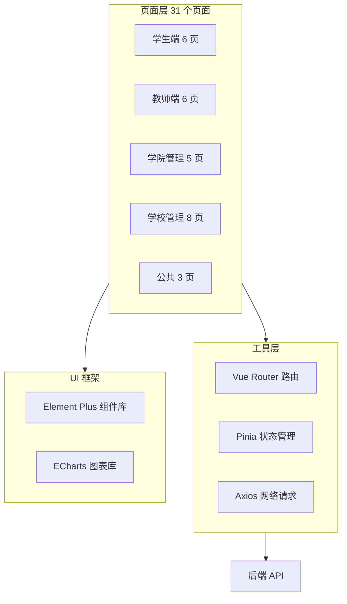
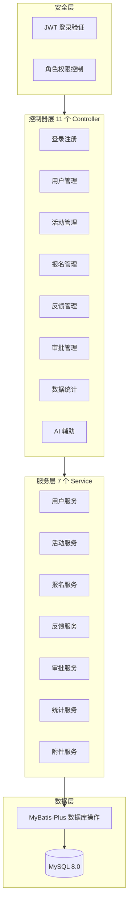
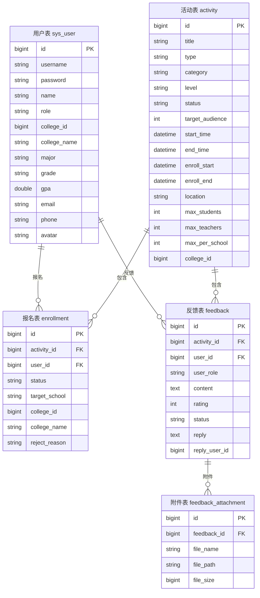
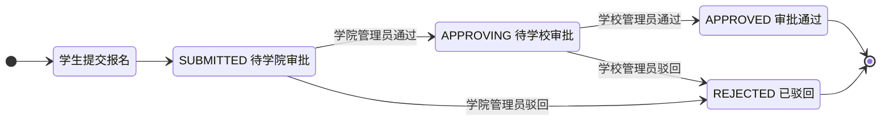
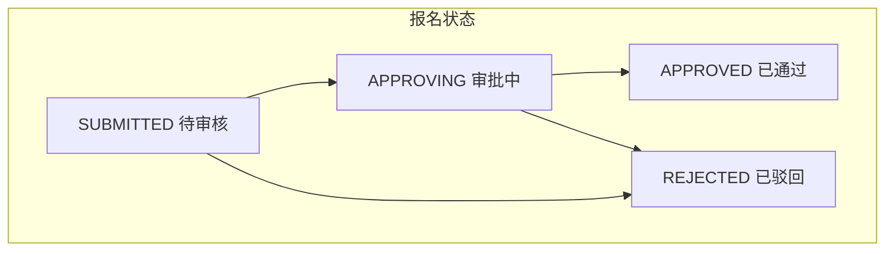
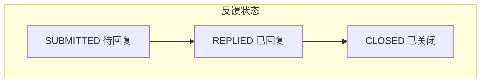

# 新疆大学招生宣传报名平台 架构设计文档

> 2026-07-13 | [github.com/spider-freedom/enrollment-platform](https://github.com/spider-freedom/enrollment-platform)

用 VS Code 打开本文档，安装插件 **Markdown Preview Mermaid**，按 `Ctrl+Shift+V` 即可看到图表渲染效果。GitHub 上也能直接渲染。

---

## 一、系统架构总览



**说明：** 前端跑在 3000 端口，通过 Vite 把 `/api` 请求转发到后端 8080。后端连 MySQL 存数据，连 Redis 做缓存，文件（头像、附件）存本地磁盘。

---

## 二、前端架构



**用什么做的：**

| 技术 | 干什么用 |
|------|---------|
| Vue 3.4 | 前端框架，搭页面 |
| TypeScript 5.4 | 给 JavaScript 加类型检查，减少 bug |
| Element Plus 2.7 | 现成的 UI 组件：表格、表单、按钮、弹窗、标签 |
| ECharts 5.5 | 数据大屏画图表：柱状图、饼图 |
| Vue Router 4.3 | 页面跳转，自动检查登录状态 |
| Pinia 2.1 | 全局存用户信息和 token |
| Axios 1.7 | 发 HTTP 请求，自动带 token，token 过期自动跳登录 |
| Vite 5.3 | 开发时启动服务器，打包时压缩代码 |

---

## 三、后端架构



**用什么做的：**

| 技术 | 干什么用 |
|------|---------|
| Java 17 | 编程语言 |
| Spring Boot 3.2.5 | 后端框架，提供 REST API |
| Spring Security | 登录验证、权限控制 |
| JWT (JJWT) | 生成登录令牌，24 小时有效 |
| MyBatis-Plus 3.5.7 | 操作数据库，写 SQL 查询，自动分页 |
| LangChain4j | 对接 DeepSeek 大模型，做 AI 分析 |
| Knife4j | 自动生成接口文档网页 |
| Apache POI | 导出 Excel 表格 |
| Redis | 缓存热点数据 |

---

## 四、数据库设计



**当前数据量：** 45 个用户、24 个活动、21 条报名、7 条反馈。

---

## 五、审批流程



**谁有权限做什么：**

| 角色 | 能做什么 |
|------|---------|
| 学生 | 看活动、报名、撤回自己的报名、提交反馈 |
| 教师 | 同学生 |
| 学院管理员 | 审批本院报名（第一步）、管理本院活动、管理本院用户 |
| 学校管理员 | 审批所有报名（第二步）、管理所有活动、管理所有用户、看数据大屏 |

---

## 六、活动状态怎么显示

不按数据库存的状态显示，而是根据当前日期自动算：

| 当前日期在哪个阶段 | 显示什么 | 能报名吗 |
|-------------------|---------|---------|
| 还没到报名开始时间 | 未开始 | 不能 |
| 报名开始 ~ 报名截止 | 报名中 | 能 |
| 报名截止后，活动开始前 | 报名已截止 | 不能 |
| 活动开始 ~ 活动结束 | 进行中 | 不能 |
| 活动结束后 | 已结束 | 不能 |

---

## 七、报名和反馈怎么流转





---

## 八、API 接口一览

**认证 (2 个)**
```
POST /api/auth/login        登录，返回 token
POST /api/auth/register     注册
```

**用户 (16 个)**
```
GET    /api/user/profile           看自己的信息
PUT    /api/user/profile           改自己的信息
PUT    /api/user/password          改密码
POST   /api/user/avatar            换头像
GET    /api/college/users/list     看本院用户
POST   /api/college/users/import   批量导入用户 (CSV)
POST   /api/college/users/{id}/promote   升为管理员
POST   /api/college/users/{id}/demote    降为教师
POST   /api/college/users/{id}/reset-password  重置密码
GET    /api/school/users/list      看全校用户
```

**活动 (11 个)**
```
POST   /api/activity/create        创建活动
PUT    /api/activity/update/{id}   编辑活动
DELETE /api/activity/delete/{id}   删除活动
GET    /api/activity/list/student  学生看的活动列表
GET    /api/activity/list/teacher  教师看的活动列表
GET    /api/activity/list/college  学院管理员看的活动列表
GET    /api/activity/list/school   学校管理员看的活动列表
GET    /api/activity/banners       轮播图列表
GET    /api/activity/export        导出 Excel
GET    /api/activity/{id}          活动详情
```

**报名 (6 个)**
```
POST /api/enrollment/submit        提交报名
GET  /api/enrollment/my            我的报名
GET  /api/enrollment/college       学院的报名
GET  /api/enrollment/school        全校的报名
POST /api/enrollment/{id}/withdraw 撤回报名
GET  /api/enrollment/export        导出 Excel
```

**审批 (5 个)**
```
GET  /api/approval/college         待学院审批的
GET  /api/approval/school          待学校审批的
POST /api/approval/approve         通过
POST /api/approval/reject          驳回
POST /api/approval/batch           批量操作
```

**反馈 (7 个)**
```
POST /api/feedback/student         学生提交反馈
POST /api/feedback/teacher         教师提交反馈
GET  /api/feedback/college         学院的反馈
GET  /api/feedback/school          全校的反馈
GET  /api/feedback/my              我的反馈
POST /api/feedback/{id}/reply      管理员回复
GET  /api/feedback/export          导出 Excel
```

**统计 (4 个)**
```
GET /api/statistics/dashboard      仪表盘数据
GET /api/statistics/trend          趋势图数据
GET /api/statistics/college        学院分布
GET /api/statistics/rating         评分分布
```

**AI (5 个)**
```
GET  /api/ai/school/suggest        搜学校名
POST /api/ai/school/normalize      标准化学校名
POST /api/ai/feedback/analyze      分析反馈情感
POST /api/ai/approval/suggest      审批建议
```