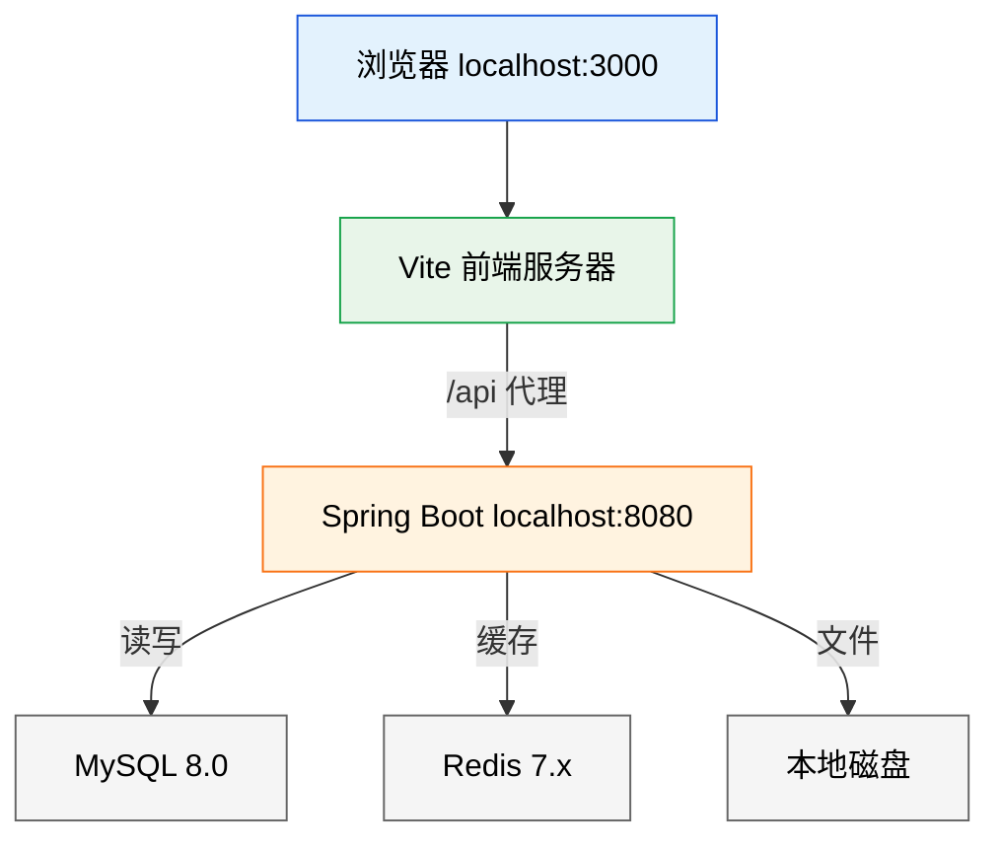
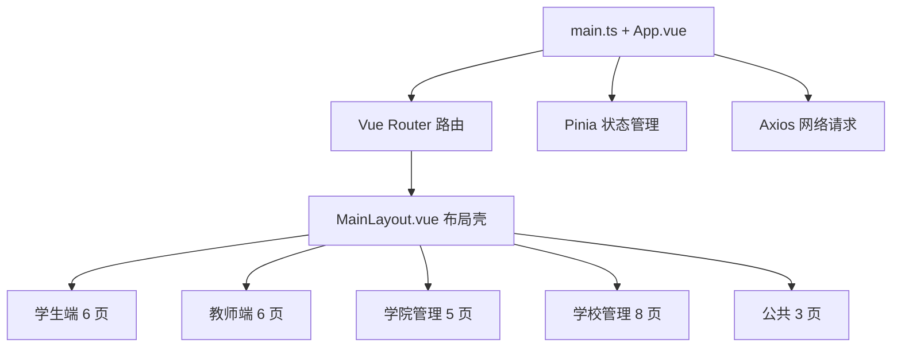
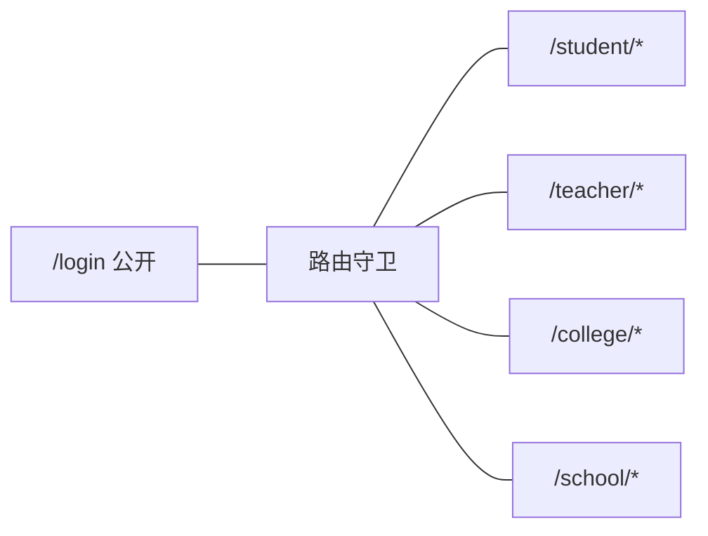
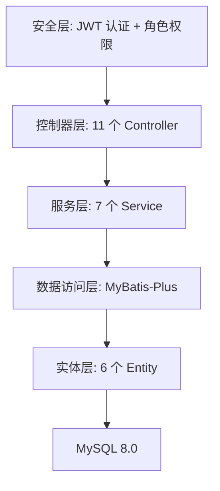
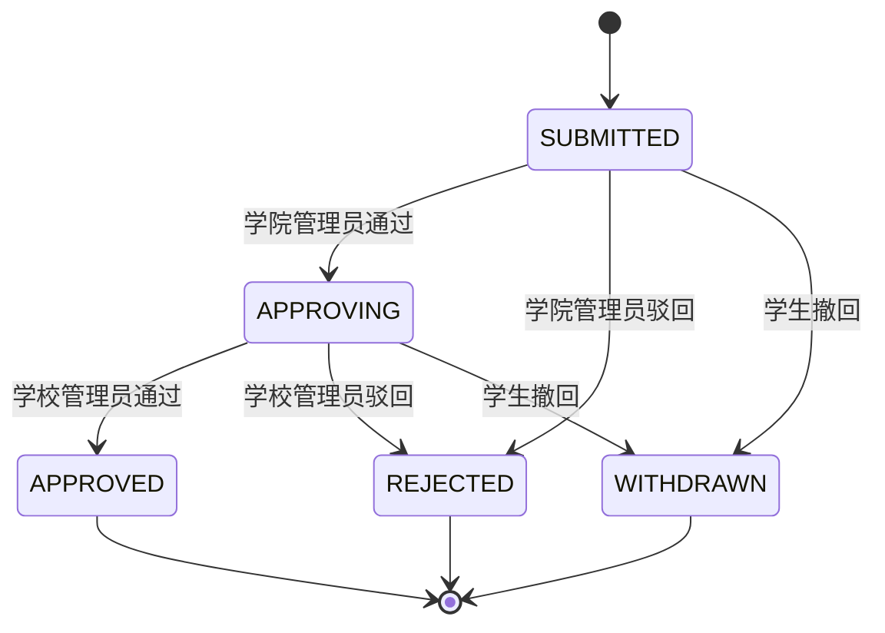
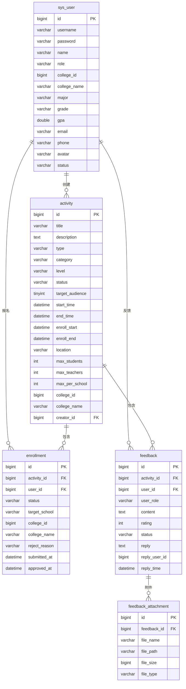

# 新疆大学招生宣传报名平台 架构设计文档

> 2026-07-13 | [github.com/spider-freedom/enrollment-platform](https://github.com/spider-freedom/enrollment-platform)

---

## 一、系统架构总览

### 图 1：系统架构总览图



**架构说明：**

浏览器访问 3000 端口打开 Vue 单页应用。前端所有 API 请求通过 Vite 代理转发到后端 8080 端口。后端收到请求后，先经过 JWT 过滤器验证登录状态，再经过权限过滤器检查角色权限，然后进入对应的控制器处理业务逻辑。业务逻辑调用 MyBatis-Plus 操作 MySQL 数据库。热点数据缓存在 Redis 中。用户上传的头像和反馈附件存储在服务器本地磁盘 ./uploads/ 目录下。

---

## 二、前端技术架构

### 图 2：前端组件架构图



**架构说明：**

应用入口 main.ts 挂载 Vue 实例，注册 Element Plus、Pinia、Router。App.vue 只有一个 `<router-view/>`，实际页面由路由决定渲染哪个组件。

所有页面套在 MainLayout.vue 布局壳中。布局壳包含左侧深色侧边栏（根据用户角色显示不同菜单项）和顶部导航栏（通知铃铛、角色标签、头像、退出按钮）。内容区渲染当前路由对应的页面组件。

页面组件通过 Pinia 的 userStore 获取用户信息和登录状态，通过 api/index.ts 中封装的 API 函数调用后端接口。API 函数底层使用 api/request.ts 中的 axios 实例，自动附加 JWT Token，自动处理 401 跳转登录。

### 图 3：前端路由结构图



### 前端技术栈明细

每个功能模块用了什么技术，为什么用：

| 功能模块 | 使用技术 | 原因 |
|---------|---------|------|
| 页面搭建 | Vue 3.4 Composition API | `<script setup>` 语法简洁，ref/reactive 响应式数据自动更新 DOM，computed 自动计算派生值，watch 监听数据变化 |
| 类型检查 | TypeScript 5.4 | 接口定义 Activity/Enrollment/Feedback/User/PageResult，组件 props 类型约束，API 返回值类型标注，编译期发现字段名拼写错误 |
| UI 组件 | Element Plus 2.7 | el-table 表格（排序、多选、固定列）、el-form 表单（校验规则）、el-dialog 弹窗、el-tag 标签、el-button 按钮、el-select 下拉、el-date-picker 日期选择、el-pagination 分页、el-avatar 头像、el-badge 角标、el-popover 气泡、el-carousel 轮播、el-rate 评分、el-progress 进度条、el-empty 空状态、el-result 异常状态、el-descriptions 描述列表、el-switch 开关、el-dropdown 下拉菜单、el-input 输入框 |
| 图标 | Element Plus Icons 2.3 | Bell（通知铃铛）、Search（搜索）、Calendar（日历）、Location（地点）、User（用户）、ArrowDown（下拉箭头）、Document（文档）、List（列表）、Checked（已选）、EditPen（编辑）、DataAnalysis（数据分析）、Plus（添加）、Management（管理）、CircleCheck（通过）、CircleClose（拒绝）、Clock（时间）、TrendCharts（趋势）、StarFilled（评分） |
| 路由跳转 | Vue Router 4.3 | createWebHistory 去掉 URL 中的 # 号，嵌套路由实现布局壳复用，beforeEach 守卫实现登录检查和角色权限校验，路由级懒加载（() => import()）减少首屏加载时间 |
| 状态管理 | Pinia 2.1 | userStore 存储 token（localStorage 持久化）、userInfo（内存）、角色权限。login 方法调 API 并将 token 存 localStorage，logout 清除所有状态，fetchProfile 刷新时恢复用户信息 |
| HTTP 通信 | Axios 1.7 | 统一 baseURL=/api，30 秒超时。请求拦截器从 localStorage 读取 token 加到 Authorization 头。响应拦截器处理两种格式（data.list 和 data.records）。401 错误时清除 token 并跳转登录页 |
| 图表绘制 | ECharts 5.5 | 学校管理员数据大屏使用：柱状图（createBarOption 函数，展示各学院报名分布和活动分类统计）、饼图（createPieOption 函数，展示评分 1-5 分布和活动类型占比）。echarts.init 初始化实例，setOption 更新数据，resize 响应窗口大小变化 |
| CSS 预处理 | Sass 1.77 | 嵌套规则减少重复选择器，变量管理颜色值（主题色 #1a56db、成功 #10b981、警告 #f59e0b、危险 #ef4444），混合宏复用渐变和阴影样式 |
| 开发构建 | Vite 5.3 | 开发时启动 dev server 支持 HMR 热更新（改代码浏览器秒刷新）。生产构建时 Tree Shaking 去除未用代码，代码分割按路由拆分 chunk。proxy 配置 /api 转发到 localhost:8080 |
| 自动导入 | unplugin-auto-import 0.17 | 自动导入 Vue Composition API（ref、reactive、computed、watch、onMounted），不用每个文件手写 import |
| 按需加载 | unplugin-vue-components 0.27 | 自动导入 Element Plus 组件，只打包用到的组件，减小产物体积 |

---

## 三、后端技术架构

### 图 4：后端分层架构图



### 图 5：审批流程状态机图



### 后端技术栈明细

每个功能模块用了什么技术，为什么用：

| 功能模块 | 使用技术 | 原因 |
|---------|---------|------|
| 项目骨架 | Spring Boot 3.2.5 | 自动配置（数据源、Redis、Jackson、Tomcat 都不用手动配），起步依赖（加一个 starter 就能用一组功能），内嵌 Tomcat（不用单独部署服务器），Actuator 健康检查（/actuator/health 随时看服务状态） |
| REST API | Spring MVC (Spring Boot 内置) | @RestController 标注控制器，@GetMapping/@PostMapping/@PutMapping/@DeleteMapping 映射 HTTP 方法，@PathVariable 提取路径参数，@RequestParam 提取查询参数，@RequestBody 提取 JSON 请求体 |
| 参数校验 | Spring Validation (Spring Boot 内置) | @Valid 注解触发校验，@NotBlank 字符串不能为空，@NotNull 对象不能为空，校验失败自动返回 400 + 错误信息，由 GlobalExceptionHandler 统一处理 |
| 认证鉴权 | Spring Security 6.1 | SecurityFilterChain 配置过滤器链，HttpSecurity 配置 URL 授权规则（/api/auth/** 放行，/api/college/** 需 COLLEGE_ADMIN 角色，/api/school/** 需 SCHOOL_ADMIN 角色），无状态会话管理（不依赖 Cookie Session） |
| JWT 令牌 | JJWT 0.12.5 | JwtUtils.generateToken 生成 Token（HS384 签名，载荷存 userId、role、sub，有效期 24 小时），JwtUtils.validateToken 验证 Token 是否过期或被篡改，JwtUtils.getUserId/getRole 从 Token 中提取信息。JwtAuthFilter 从请求头 Authorization 中提取 Bearer Token 并验证 |
| 密码加密 | BCrypt (Spring Security 内置) | BCryptPasswordEncoder 注册为 Bean，注册用户时 encode 加密存储，登录时 matches 比较明文和密文 |
| 数据库操作 | MyBatis-Plus 3.5.7 | BaseMapper 提供通用 CRUD（insert、updateById、deleteById、selectById、selectList、selectCount、selectPage）。LambdaQueryWrapper 用 Lambda 表达式代替字符串写查询条件，避免字段名拼写错误。Page + selectPage 实现物理分页。map-underscore-to-camel-case 自动将数据库下划线列名转为 Java 驼峰属性名 |
| 分页查询 | MyBatis-Plus Page + IPage | 所有列表接口统一用 PageResult（list、total、page、size）包裹返回。Page 对象传入 selectPage 自动拦截 SQL 加 LIMIT 和 COUNT |
| 自动填充 | MyBatis-Plus MetaObjectHandler | MetaObjectHandlerConfig 实现 insertFill 和 updateFill，插入时自动填入 createTime 和 updateTime，更新时自动填入 updateTime。实体字段需要 @TableField(fill = FieldFill.INSERT) 注解配合 |
| 事务管理 | Spring @Transactional | UserService 类级别加 @Transactional，所有写操作（register、updateProfile、changePassword、promote、demote、delete、importUsers 等）在一个事务中完成，失败自动回滚。ActivityService 同理。FeedbackService 在 submitStudent、submitTeacher、reply 方法级加 @Transactional |
| AI 集成 | LangChain4j 0.35.0 | 统一抽象层对接不同 LLM 提供商。当前配置 DeepSeek OpenAI 兼容接口（baseUrl、apiKey、modelName=deepseek-chat、temperature=0.3、maxTokens=4096）。SchoolNameNormalizer 调用 ChatLanguageModel 做学校名称标准化，FeedbackAnalyzer 做反馈情感分析和关键词提取 |
| API 文档 | Knife4j 4.5.0 | 自动扫描所有 @RestController 生成 OpenAPI 3.0 规范文档，访问 /doc.html 查看 Swagger UI 页面，可直接在页面上调试接口 |
| Excel 导出 | Apache POI 5.2.5 | ExcelExportUtil 封装通用导出逻辑：创建 XSSFWorkbook，写表头行（加粗居中），遍历数据集合写数据行，设置列宽自适应，输出到 HttpServletResponse。活动、报名、反馈三处导出复用此工具类 |
| JSON 序列化 | Jackson (Spring Boot 内置) | 自动将 Controller 返回的对象序列化为 JSON 字符串响应给前端。LocalDateTime 自动序列化为 ISO 8601 格式（2026-07-13T14:30:00）。前端传来的 JSON 自动反序列化为 Java 对象 |
| 文件上传 | Spring MultipartFile | 头像上传（POST /api/user/avatar）和附件上传（POST /api/feedback/attachment/upload）都用 MultipartFile 接收，Files.write 写入磁盘。WebMvcConfig 配置 /uploads/** 路径映射到 ./uploads/ 目录，文件可通过 URL 直接访问 |
| 缓存 | Spring Data Redis (Spring Boot 内置) | Redis 自动配置连接池，application.yml 配置 host/port/password。当前用于缓存热点数据 |
| 日志 | SLF4J + Logback (Spring Boot 内置) | MyBatis-Plus 配置 stdout 日志输出，开发时可以看到每条 SQL 语句和参数 |

---

## 四、数据库设计

### 图 6：数据库 ER 图



### 表结构说明

**sys_user（用户表）**：45 条记录。存储所有用户信息。role 字段区分 4 种角色：STUDENT（学生）、TEACHER（教师）、COLLEGE_ADMIN（学院管理员）、SCHOOL_ADMIN（学校管理员）。college_id 和 college_name 记录所属学院。学生特有字段：major（专业）、grade（年级）、gpa（绩点）。密码使用 BCrypt 加密存储。status 字段标识账号是否启用（ACTIVE/DISABLED）。

**activity（活动表）**：24 条记录。type 区分 ONLINE（线上）和 OFFLINE（线下）。category 区分 9 种分类：宣讲会、开放日、夏令营、咨询会、回访母校、线上直播、走访宣讲、招生宣传、其他。level 区分院级和校级。status 标识活动生命周期：DRAFT（草稿）→ PUBLISHED（已发布）→ ONGOING（进行中）→ ENDED（已结束）。target_audience 控制面向人群：1=仅学生、2=仅教师、3=学生+教师。enroll_start 和 enroll_end 定义报名时间窗口。start_time 和 end_time 定义活动实际举办时间。max_per_school 限制每所高中最大报名人数。workflow_key 指定审批流程类型。college_id 关联归属学院（校级活动为 NULL）。deleted 字段预留逻辑删除支持。

**enrollment（报名表）**：21 条记录。用户对活动的一对一报名关系（UNIQUE(user_id, activity_id) 唯一约束）。status 流转：SUBMITTED（已提交）→ APPROVING（待学校审批）→ APPROVED（已通过）/ REJECTED（已驳回）/ WITHDRAWN（已撤回）。target_school 记录招生目标高中名称。form_data 存储自定义表单字段的 JSON 数据。college_id 和 college_name 记录报名时学生的学院信息。rank_in_group 和 group_name 用于按目标学校分组排名。reject_reason 记录驳回原因。

**feedback（反馈表）**：7 条记录。用户对活动的一对一反馈关系（UNIQUE(user_id, activity_id) 唯一约束）。rating 评分 1-5。status 流转：SUBMITTED（待回复）→ REPLIED（已回复）→ CLOSED（已关闭）。reply、reply_user_id、reply_time 存储管理员回复内容和时间。

**feedback_attachment（附件表）**：暂无记录。反馈回复时上传的附件，支持多个附件关联一个反馈。file_name 原始文件名、file_path 服务器存储路径、file_size 字节数。

**activity_field_config（活动自定义字段表）**：3 条记录。管理员创建活动时可以添加自定义字段（如目标学校、个人简介、简历附件）。field_type 支持 TEXT（文本）、SELECT（下拉）、DATE（日期）、FILE（文件）。enable_ai_normalize 标记字段值是否需要 AI 标准化处理。

### 关键约束和索引

| 表 | 约束类型 | 字段 | 作用 |
|------|---------|------|------|
| sys_user | UNIQUE | username | 学号/工号不能重复 |
| enrollment | UNIQUE | (user_id, activity_id) | 同一用户对同一活动只能报名一次 |
| feedback | UNIQUE | (user_id, activity_id) | 同一用户对同一活动只能反馈一次 |
| activity | INDEX | status | 按状态筛选活动时加速查询 |
| activity | INDEX | type | 按线上线下筛选时加速查询 |
| activity | INDEX | creator_id | 按创建人筛选时加速查询 |
| enrollment | INDEX | activity_id | 按活动查询报名时加速 |
| enrollment | INDEX | user_id | 按用户查询报名时加速 |
| enrollment | INDEX | status | 按报名状态筛选时加速 |
| feedback | INDEX | activity_id | 按活动查询反馈时加速 |
| feedback | INDEX | user_id | 按用户查询反馈时加速 |
| feedback | INDEX | status | 按反馈状态筛选时加速 |
| feedback_attachment | INDEX | feedback_id | 按反馈查询附件时加速 |
| feedback_attachment | FOREIGN KEY | feedback_id | 删除反馈时级联删除附件 |

---

## 五、前端状态显示逻辑

### 活动状态由日期驱动

前端不直接显示数据库中的静态状态值，而是根据当前日期和活动的日期字段动态计算：

| 日期条件 | 显示文字 | 标签颜色 | 报名按钮 |
|----------|---------|---------|---------|
| 当前时间 < enrollStart | "未开始" | 灰色 | 不可报名 |
| enrollStart ≤ 当前时间 ≤ enrollEnd | "报名中" | 绿色 | 立即报名 |
| enrollEnd < 当前时间 < startTime | "报名已截止" | 红色 | 不可报名 |
| startTime ≤ 当前时间 ≤ endTime | "进行中" | 橙色 | 不可报名 |
| 当前时间 > endTime | "已结束" | 灰色 | 不可报名 |

实现函数：`getDisplayStatus(activity)` 在 utils/constants.ts 中，所有活动列表和详情页统一调用。

### 报名状态映射

| 数据库值 | 显示文字 | 标签颜色 |
|---------|---------|---------|
| SUBMITTED | 待审核 | 蓝色 |
| APPROVING | 审批中 | 橙色 |
| APPROVED | 已通过 | 绿色 |
| REJECTED | 已驳回 | 红色 |
| WITHDRAWN | 已撤回 | 灰色 |

### 反馈状态映射

| 数据库值 | 显示文字 | 标签颜色 |
|---------|---------|---------|
| SUBMITTED | 待回复 | 橙色 |
| REPLIED | 已回复 | 绿色 |
| CLOSED | 已关闭 | 灰色 |

---

## 六、权限矩阵

| 操作 | 学生 | 教师 | 学院管理员 | 学校管理员 |
|------|-----|-----|----------|----------|
| 浏览活动列表 | 看学生+师生 | 看教师+师生 | 看本院院级 | 看全部 |
| 查看活动详情 | 能 | 能 | 能 | 能 |
| 报名活动 | 能 | 能 | 不能 | 不能 |
| 撤回报名 | 自己 SUBMITTED/APPROVING | 同上 | 不能 | 不能 |
| 提交反馈 | 报名已通过的活动 | 同上 | 不能 | 不能 |
| 学院审批 | 不能 | 不能 | 本院 SUBMITTED | 不能 |
| 学校审批 | 不能 | 不能 | 不能 | 全部 APPROVING |
| 创建活动 | 不能 | 不能 | 院级（自动设本院） | 院级+校级 |
| 编辑活动 | 不能 | 不能 | 本院院级 | 全部 |
| 删除活动 | 不能 | 不能 | 本院院级 | 全部 |
| 管理反馈 | 不能 | 不能 | 本院 | 全校 |
| 管理用户 | 不能 | 不能 | 本院（增删改查） | 全校（增删改查+权限） |
| 看数据大屏 | 不能 | 不能 | 不能 | 能 |

---

## 七、API 接口清单

### 认证（2 个）

| 方法 | 路径 | 权限 | 说明 |
|------|------|------|------|
| POST | /api/auth/login | 公开 | 账号密码登录，返回 JWT Token 和用户信息 |
| POST | /api/auth/register | 公开 | 学生/教师注册 |

### 用户（16 个）

| 方法 | 路径 | 权限 | 说明 |
|------|------|------|------|
| GET | /api/user/profile | 登录 | 获取当前用户完整信息 |
| PUT | /api/user/profile | 登录 | 更新个人信息（姓名、学院、专业、年级、邮箱、手机、头像 URL） |
| PUT | /api/user/password | 登录 | 修改密码（需验证旧密码） |
| POST | /api/user/avatar | 登录 | 上传头像图片（<=2MB），保存到 ./uploads/avatars/ |
| GET | /api/college/users/list | COLLEGE_ADMIN | 查看本院所有用户 |
| GET | /api/college/users/admins | COLLEGE_ADMIN | 查看本院管理员列表 |
| POST | /api/college/users/{id}/promote | COLLEGE_ADMIN | 提升教师为学院管理员 |
| POST | /api/college/users/{id}/demote | COLLEGE_ADMIN | 降级学院管理员为教师 |
| POST | /api/college/users/{id}/reset-password | COLLEGE_ADMIN | 重置用户密码为 123456 |
| POST | /api/college/users/{id}/status | COLLEGE_ADMIN | 切换用户启用/禁用状态 |
| DELETE | /api/college/users/{id} | COLLEGE_ADMIN | 软删除用户（设为 DISABLED） |
| POST | /api/college/users/import | COLLEGE_ADMIN | CSV 批量导入用户 |
| GET | /api/school/users/list | SCHOOL_ADMIN | 查看全校所有用户 |
| POST | /api/school/users/{id}/promote-college | SCHOOL_ADMIN | 提升为学院管理员 |
| POST | /api/school/users/{id}/promote-school | SCHOOL_ADMIN | 提升为学校管理员 |
| POST | /api/school/users/{id}/demote | SCHOOL_ADMIN | 降为教师 |

### 活动（11 个）

| 方法 | 路径 | 权限 | 说明 |
|------|------|------|------|
| POST | /api/activity/create | 登录 | 创建活动（默认状态 DRAFT） |
| PUT | /api/activity/update/{id} | 登录 | 编辑活动全部字段 |
| DELETE | /api/activity/delete/{id} | 登录 | 物理删除活动 |
| POST | /api/activity/{id}/banner | 登录 | 切换轮播图状态（isBanner 0/1） |
| GET | /api/activity/list/student | 登录 | 学生活动列表（filter: targetAudience=1或3, status=PUBLISHED或ONGOING） |
| GET | /api/activity/list/teacher | 登录 | 教师活动列表（filter: targetAudience=2或3, status=PUBLISHED或ONGOING） |
| GET | /api/activity/list/college | 登录 | 学院活动列表（filter: level=院级, collegeId=本院） |
| GET | /api/activity/list/school | 登录 | 全校活动列表（全部） |
| GET | /api/activity/banners | 登录 | 轮播图活动列表（isBanner=1, status=PUBLISHED或ONGOING） |
| GET | /api/activity/export | 登录 | 导出活动 Excel |
| GET | /api/activity/{id} | 登录 | 活动详情（含创建人姓名） |

### 报名（6 个）

| 方法 | 路径 | 权限 | 说明 |
|------|------|------|------|
| POST | /api/enrollment/submit | 登录 | 提交报名（校验状态、时间窗口、名额、重复） |
| GET | /api/enrollment/my | 登录 | 我的报名列表（含活动标题，分页） |
| GET | /api/enrollment/college | 登录 | 学院报名列表（筛选本院） |
| GET | /api/enrollment/school | 登录 | 全校报名列表 |
| POST | /api/enrollment/{id}/withdraw | 登录 | 撤回报名（仅 SUBMITTED/APPROVING） |
| GET | /api/enrollment/export | 登录 | 导出报名 Excel |

### 审批（5 个）

| 方法 | 路径 | 权限 | 说明 |
|------|------|------|------|
| GET | /api/approval/college | 登录 | 学院待审批列表（filter: collegeId=本院, status=SUBMITTED） |
| GET | /api/approval/school | 登录 | 学校待审批列表（filter: status=APPROVING） |
| POST | /api/approval/approve | 登录 | 审批通过（学院: SUBMITTED→APPROVING, 学校: APPROVING→APPROVED） |
| POST | /api/approval/reject | 登录 | 驳回（status→REJECTED, 记录原因） |
| POST | /api/approval/batch | 登录 | 批量审批（传入 enrollmentIds 数组） |

### 反馈（7 个）

| 方法 | 路径 | 权限 | 说明 |
|------|------|------|------|
| POST | /api/feedback/student | 登录 | 学生提交反馈（需已报名且已通过） |
| POST | /api/feedback/teacher | 登录 | 教师提交反馈（同上，附加院系信息） |
| GET | /api/feedback/college | 登录 | 学院反馈列表（筛选本院用户提交的反馈） |
| GET | /api/feedback/school | 登录 | 全校反馈列表 |
| GET | /api/feedback/my | 登录 | 我的反馈列表（含回复内容） |
| POST | /api/feedback/{id}/reply | 登录 | 管理员回复反馈（状态→REPLIED） |
| GET | /api/feedback/export | 登录 | 导出反馈 Excel |

### 统计（4 个）

| 方法 | 路径 | 权限 | 说明 |
|------|------|------|------|
| GET | /api/statistics/dashboard | 登录 | 仪表盘数据（活动总数、报名数、通过率、反馈率、均分） |
| GET | /api/statistics/trend | 登录 | 月度报名趋势（近 7 个月） |
| GET | /api/statistics/college | 登录 | 学院报名分布（各学院报名人数） |
| GET | /api/statistics/rating | 登录 | 评分分布（1-5 分各多少人） |

### AI（5 个）

| 方法 | 路径 | 权限 | 说明 |
|------|------|------|------|
| GET | /api/ai/school/suggest | 登录 | 学校名称联想（输入关键词返回建议列表） |
| POST | /api/ai/school/normalize | 登录 | 学校名称标准化（输入非标准名返回规范名） |
| POST | /api/ai/feedback/analyze | 登录 | 反馈情感分析 |
| POST | /api/ai/feedback/summarize | 登录 | 多条反馈摘要生成 |
| POST | /api/ai/approval/suggest | 登录 | 审批建议（分析 GPA + 目标学校 + 报名数据） |

---

## 八、项目文件清单

### 后端 66 个 Java 文件

```
enrollment-backend/src/main/java/com/xju/enrollment/

ai/                                          AI 模块
  AiConfig.java                              配置 LangChain4j ChatLanguageModel Bean
  SchoolNameNormalizer.java                  学校名称标准化器
  FeedbackAnalyzer.java                      反馈分析器

common/                                      通用组件
  ApiResponse.java                           统一响应包装 {code, message, data}
  PageResult.java                            分页结果 {list, total, page, size}
  BusinessException.java                     业务异常类
  GlobalExceptionHandler.java                全局异常处理器（@RestControllerAdvice）
  ExcelExportUtil.java                       Excel 导出工具（Apache POI）

config/                                      配置类
  CorsConfig.java                            跨域配置
  MybatisPlusConfig.java                     MyBatis-Plus 分页插件配置
  MetaObjectHandlerConfig.java               createTime/updateTime 自动填充
  WebMvcConfig.java                          静态资源 /uploads/** 映射

controller/
  AiController.java                          AI 接口控制器

entity/                                      实体类（对应 6 张表）
  User.java
  Activity.java
  Enrollment.java
  Feedback.java
  FeedbackAttachment.java
  ActivityFieldConfig.java

mapper/                                      MyBatis-Plus Mapper 接口
  UserMapper.java
  ActivityMapper.java
  EnrollmentMapper.java
  FeedbackMapper.java
  FeedbackAttachmentMapper.java
  ActivityFieldConfigMapper.java

modules/activity/                            活动模块
  controller/ActivityController.java
  service/ActivityService.java
  dto/ActivityRequest.java                   创建/编辑请求 DTO
  dto/ActivityListQuery.java                 列表查询 DTO
  dto/ActivityVO.java                        视图对象 + from() 静态工厂

modules/enrollment/                          报名模块
  controller/EnrollmentController.java
  service/EnrollmentService.java
  dto/EnrollmentRequest.java
  dto/EnrollmentVO.java

modules/feedback/                            反馈模块
  controller/FeedbackController.java
  controller/AttachmentController.java
  service/FeedbackService.java
  service/AttachmentService.java
  dto/FeedbackSubmitRequest.java
  dto/FeedbackReplyRequest.java
  dto/FeedbackQuery.java
  dto/FeedbackVO.java

modules/statistics/                          统计模块
  controller/StatisticsController.java
  service/StatisticsService.java
  dto/DashboardVO.java
  dto/TrendVO.java
  dto/CollegeStatVO.java

modules/system/                              用户模块
  controller/AuthController.java             登录注册
  controller/UserController.java             个人信息
  controller/CollegeUserController.java      学院用户管理
  controller/SchoolUserController.java       学校用户管理
  service/UserService.java                   用户业务逻辑
  dto/LoginRequest.java
  dto/RegisterRequest.java
  dto/ChangePasswordRequest.java
  dto/UserVO.java

modules/workflow/                            审批模块
  controller/ApprovalController.java
  service/ApprovalService.java
  dto/ApprovalRequest.java
  dto/BatchApprovalRequest.java
  dto/ApprovalVO.java

security/                                    安全模块
  SecurityConfig.java                        Spring Security 过滤器链配置
  JwtUtils.java                              JWT 生成、验证、解析工具
  JwtAuthFilter.java                         JWT 认证过滤器
  SecurityUtils.java                         获取当前用户 ID 的工具类
```

### 前端 38 个源文件

```
enrollment-frontend/src/

api/
  request.ts                                  axios 实例 + Token 拦截器 + downloadFile
  index.ts                                    11 个 API 模块

layouts/
  MainLayout.vue                              主布局（侧边栏 + 导航 + 通知 + 退出）

router/
  index.ts                                    5 组路由 + beforeEach 守卫

stores/
  user.ts                                     Pinia userStore

types/
  index.ts                                    TS 接口定义

utils/
  constants.ts                                状态映射 + 日期驱动 + 分类选项

views/
  LoginView.vue                               登录页（渐变蓝色背景 + 卡片表单）
  RegisterView.vue                            注册页
  ProfileView.vue                             个人信息（头像上传 + 信息编辑 + 密码修改）

  StudentActivityList.vue                     学生活动列表（轮播 + 分类筛选 + 卡片网格）
  StudentActivityDetail.vue                   学生活动详情 + 报名弹窗
  StudentEnrollments.vue                      学生已报名活动列表
  StudentFeedbackSubmit.vue                   学生提交反馈
  StudentMyFeedback.vue                       学生查看反馈和回复

  TeacherActivityList.vue                     教师活动列表
  TeacherActivityDetail.vue                   教师活动详情
  TeacherEnrollments.vue                      教师已报名活动列表
  TeacherFeedbackSubmit.vue                   教师提交反馈
  TeacherMyFeedback.vue                       教师查看反馈和回复

  CollegeActivityList.vue                     学院活动管理（统计 + 表格 + 创建/编辑/删除）
  CollegeApprovalList.vue                     学院报名审批（通过/驳回/批量 + AI 建议）
  CollegeFeedbackList.vue                     学院反馈管理（查看/回复）
  CollegeUserManagement.vue                   学院用户管理（增删改查 + 导入 + 分页）

  SchoolDashboard.vue                         学校数据大屏（ECharts 图表）
  SchoolActivityList.vue                      学校活动管理
  SchoolActivityCreate.vue                    学校活动创建/编辑表单
  SchoolApprovalList.vue                      学校报名审批
  SchoolFeedbackList.vue                      学校反馈管理
  SchoolUserManagement.vue                    学校用户管理
```