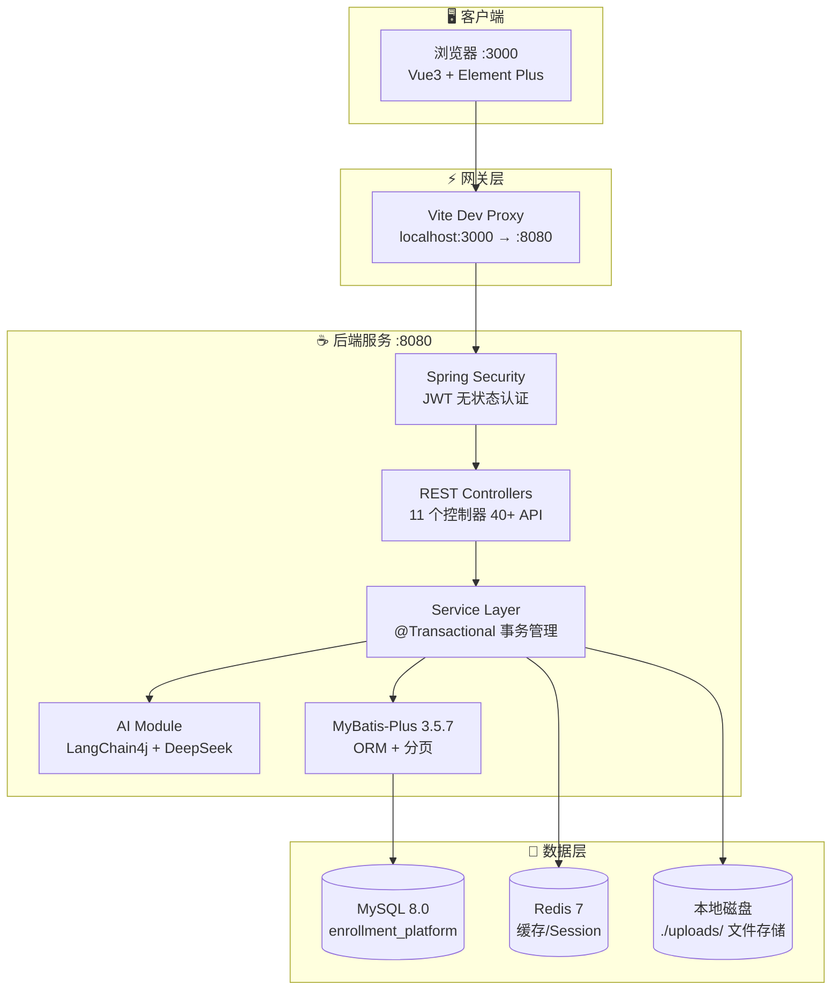
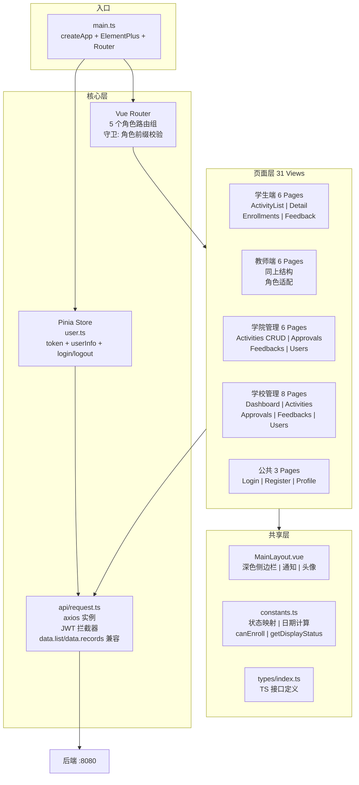
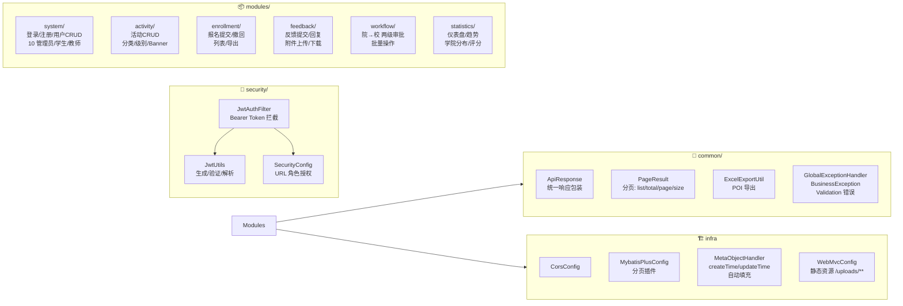
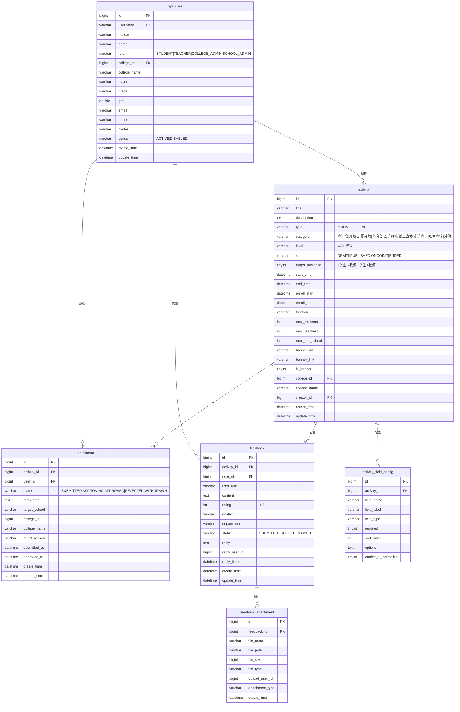
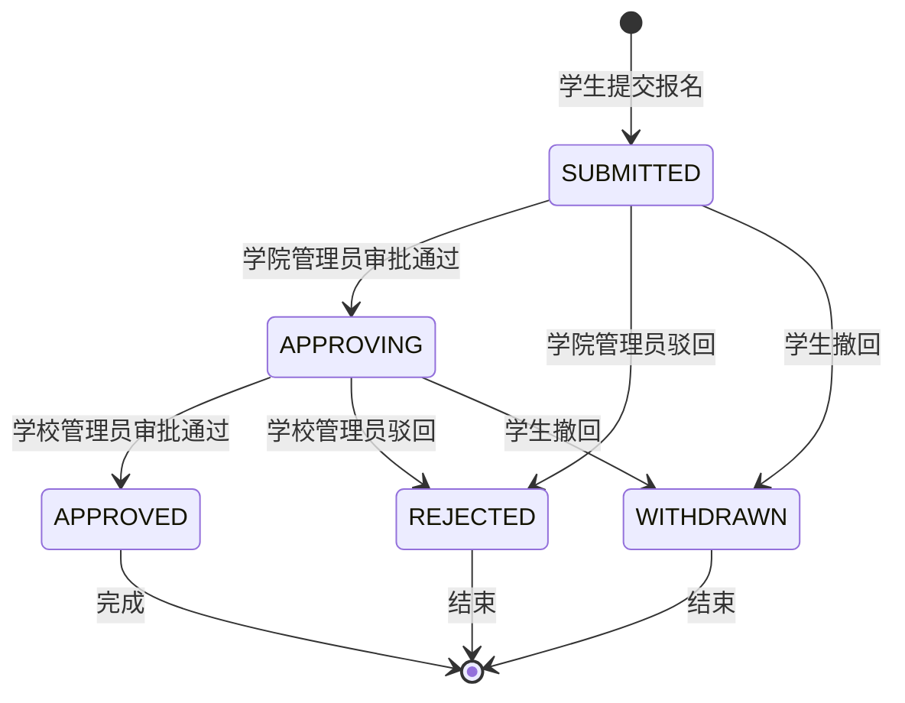
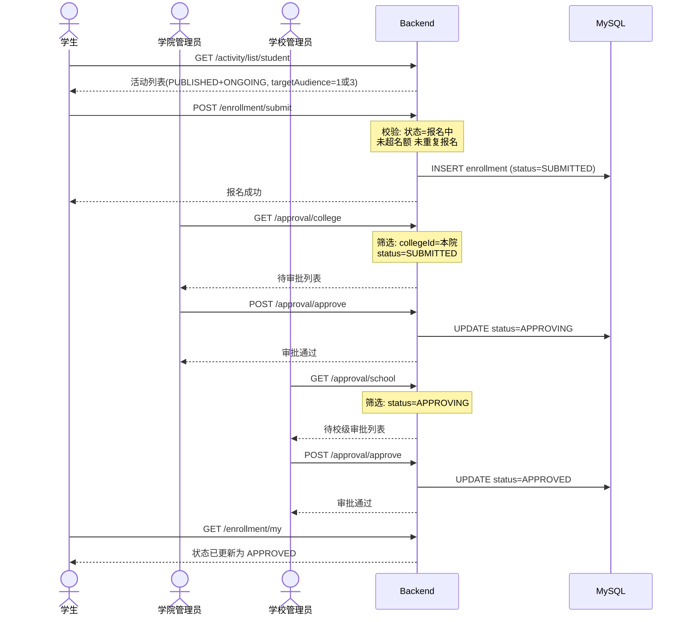

# 新疆大学招生宣传报名平台 — 架构设计文档

> 自动生成于 2026-07-13 | 项目: [spider-freedom/enrollment-platform](https://github.com/spider-freedom/enrollment-platform)

---

## 一、系统架构总览

---

## 二、前端架构

---

## 三、后端模块结构

---

## 四、数据库 ER 图

---

## 五、审批流程

---

## 六、数据流 — 报名全链路

---

## 七、技术栈详情

| 层级 | 技术 | 版本 | 用途 |
|------|------|------|------|
| 语言 | Java | 17 | 后端 |
| 框架 | Spring Boot | 3.2.5 | REST API |
| 安全 | Spring Security + JJWT | 0.12.5 | JWT 无状态认证 |
| ORM | MyBatis-Plus | 3.5.7 | 数据库操作 + 分页 |
| AI | LangChain4j | 0.35.0 | DeepSeek 集成 |
| 文档 | Knife4j | 4.5.0 | Swagger UI |
| 语言 | TypeScript | 5.4 | 前端 |
| 框架 | Vue 3 | 3.4 | SPA |
| UI | Element Plus | 2.7 | 组件库 |
| 图表 | ECharts | 5.5 | 数据大屏 |
| 构建 | Vite | 5.3 | 前端构建 |
| 数据库 | MySQL | 8.0 | 主存储 |
| 缓存 | Redis | 7 | 缓存 |